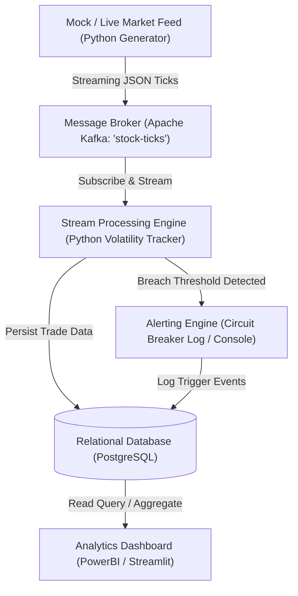

# Realtime Stock Market Analytics

A real-time data streaming pipeline designed to ingest stock market trades, detect high-volatility events, and trigger automated circuit-breaker alerts.

## Project Contributors
* Rishav Singh
* Pratima Bastola

*Both contributors work collaboratively across the entire stack: system design, Kafka streaming, PostgreSQL data modeling, and visualization.*

---

## 🛠️ Tech Stack
* **Language:** Python 3.10+
* **Visualization & Analytics:** Streamlit, Plotly, Pandas
* **Message Broker (Planned):** Apache Kafka
* **Storage (Planned):** PostgreSQL
* **Version Control:** Git, GitHub

---

## 🚀 Milestones Completed

### Week 1 Milestones Completed
* Collaboratively designed the end-to-end streaming architecture.
* Researched circuit-breaker logic parameters and thresholds.
* Finalized initial PostgreSQL schema (`schema.sql`) for trade ingestion and alert logging.

### Week 2 Milestones Completed
* Built a continuous tick simulator (`week2/nifty50_simulator.py`) generating live trade ticks (~2.5 ticks/sec) across 10 major NIFTY 50 equities.
* Implemented in-stream percentage drift evaluation to trigger automated circuit-breaker alerts when price moves reach or exceed ±5%.
* Developed an interactive dashboard (`week2/dashboard.py`) using Streamlit and Plotly with dynamic OHLC candlestick resampling (2s to 30s) and transaction volume bars.
* Verified and documented execution runs locally via terminal and visualizer.

---

## 🏗️ Proposed System Pipeline (Under Research)

---

## 📚 Academic References & Theoretical Foundations

This project grounds its real-time streaming architecture and risk mechanics in established academic literature:

1. **Distributed Event Streaming:**
   * Kreps, J., Narkhede, N., & Rao, J. (2011). ["Kafka: A Distributed Messaging System for Log Processing."](https://netdb.csc.ncsu.edu/netdb11/papers/netdb11-final12.pdf) *Proceedings of the 6th International Workshop on Networking Meets Databases (NetDB)*.
   * *Focus:* High-throughput, log-structured message brokers using sequential disk I/O and zero-copy transfers (`sendfile`) to decouple tick ingestion from downstream analytical consumers.

2. **In-Stream Processing & Complex Event Evaluation:**
   * Wu, E., Diao, Y., & Rizvi, S. (2006). ["High-Performance Complex Event Processing over Streams."](https://cs.brown.edu/courses/cs295-11/2007/complex.pdf) *Proceedings of the 2006 ACM SIGMOD International Conference on Management of Data*.
   * *Focus:* Finite automata evaluation over sliding time windows to process complex event patterns in active memory, validating our decision to evaluate circuit-breaker thresholds in-stream before storage.

3. **Market Microstructure & Trading Halts:**
   * Subrahmanyam, A. (1994). ["Circuit Breakers and Market Volatility: A Theoretical Perspective."](https://ideas.repec.org/a/bla/jfinan/v49y1994i1p237-54.html) *The Journal of Finance, 49(1), pp. 237–254*.
   * *Focus:* Theoretical modeling of the "magnet effect"—traders advancing orders as price bands near, which can increase price variability. Informs our understanding that a fixed ±5% tripwire is an engineering testing heuristic rather than a full model of real-world trading behavior.

4. **Real-Time Stream Engine Architecture:**
   * Stonebraker, M., Çetintemel, U., & Zdonik, S. (2005). ["The 8 Requirements of Real-Time Stream Processing."](https://cs.brown.edu/people/ugur/8rulesSigRec.pdf) *ACM SIGMOD Record, 34(4), pp. 42–47*.
   * *Focus:* Emphasizes Rule 1 ("Keep the data moving" without waiting for static database writes), justifying our pipeline design to keep PostgreSQL off the critical real-time alert evaluation path.
