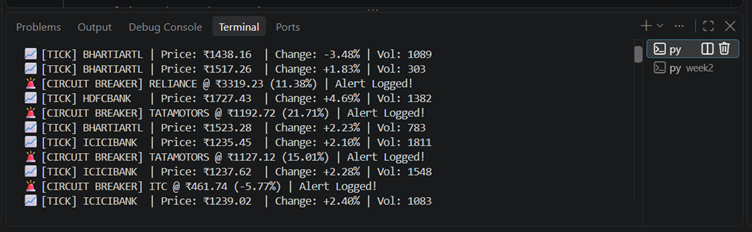
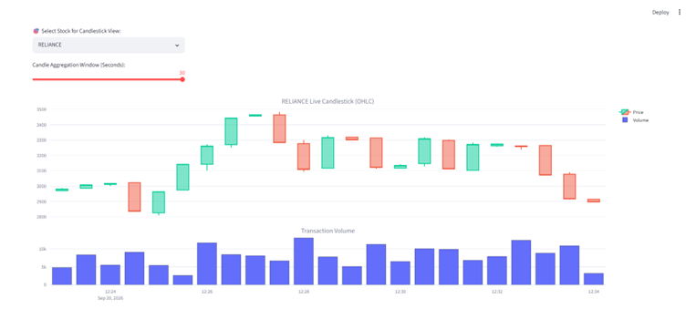
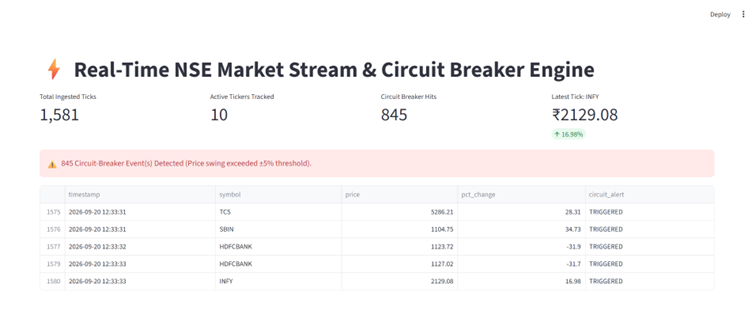
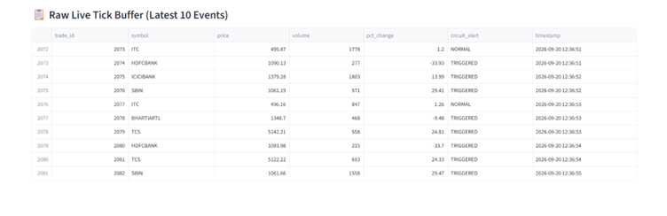

# Realtime Stock Market Analytics

A real-time data streaming pipeline designed to ingest stock market trades, detect high-volatility events, and trigger automated circuit-breaker alerts.

## Project Contributors
* Rishav Singh
* Pratima Bastola

*Both contributors work collaboratively across the entire stack: system design, Kafka streaming, PostgreSQL data modeling, and visualization.*

---

## 🛠️ Tech Stack
* **Language:** Python 3.10+
* **Visualization & Analytics:** Streamlit, Plotly, Pandas
* **Message Broker (Planned):** Apache Kafka
* **Storage (Planned):** PostgreSQL
* **Version Control:** Git, GitHub

---

## 🚀 Milestones Completed

### Week 1 Milestones Completed
* Collaboratively designed the end-to-end streaming architecture.
* Researched circuit-breaker logic parameters and thresholds.
* Finalized initial PostgreSQL schema (`schema.sql`) for trade ingestion and alert logging.

### Week 2 Milestones Completed
* Built a continuous tick simulator (`week2/nifty50_simulator.py`) generating live trade ticks (~2.5 ticks/sec) across 10 major NIFTY 50 equities.
* Implemented in-stream percentage drift evaluation to trigger automated circuit-breaker alerts when price moves reach or exceed ±5%.
* Developed an interactive dashboard (`week2/dashboard.py`) using Streamlit and Plotly with dynamic OHLC candlestick resampling (2s to 30s) and transaction volume bars.
* Documented visual pipeline execution proofs and saved execution captures in `Screenshots/`.

---

## 📸 Week 2 Execution Proof

### 1. Terminal Tick Stream & Circuit Breaker Logs


### 2. Interactive Candlestick (OHLC) & Volume Distribution


### 3. System Metrics & Alert Incident Audit Table


### 4. Raw Live Tick Buffer


---

## 🏗️ Proposed System Pipeline (Under Research)

```mermaid
flowchart TD
    A["Mock / Live Market Feed (Python Generator)"] -->|Streaming JSON Ticks| B["Message Broker (Apache Kafka: 'stock-ticks')"]
    B -->|Subscribe & Stream| C["Stream Processing Engine (Python Volatility Tracker)"]
    C -->|Breach Threshold Detected| D["Alerting Engine (Circuit Breaker Log / Console)"]
    C -->|Persist Trade Data| E[("Relational Database (PostgreSQL)")]
    D -->|Log Trigger Events| E
    E -->|Read Query / Aggregate| F["Analytics Dashboard (PowerBI / Streamlit)"]
