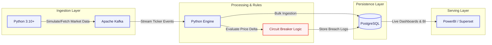
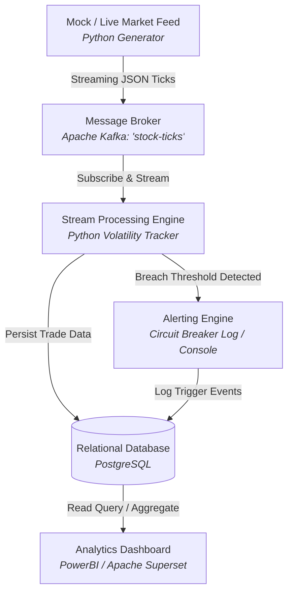

# Realtime Stock Market Analytics

A real-time data streaming pipeline designed to ingest stock market trades, detect high-volatility events, and trigger automated circuit-breaker alerts.

## Project Contributors
* Rishav Singh
* Pratima Bastola

*Both contributors work collaboratively across the entire stack: system design, Kafka streaming, PostgreSQL data modeling, and visualization.*

## Tech Stack
* Language: Python
* Streaming: Apache Kafka
* Storage: PostgreSQL
* Dashboard: PowerBI / Superset

## Week 1 Milestones Completed
* Collaboratively designed the end-to-end streaming architecture.
* Researched circuit-breaker logic parameters and thresholds.
* Finalized initial PostgreSQL schema for trade ingestion and alert logging.

* ## Tools & Technology Breakdown (Under Research)

* ## Proposed System Pipeline (Under Research)

